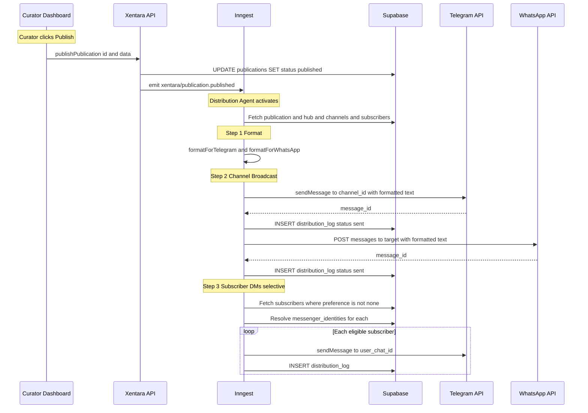
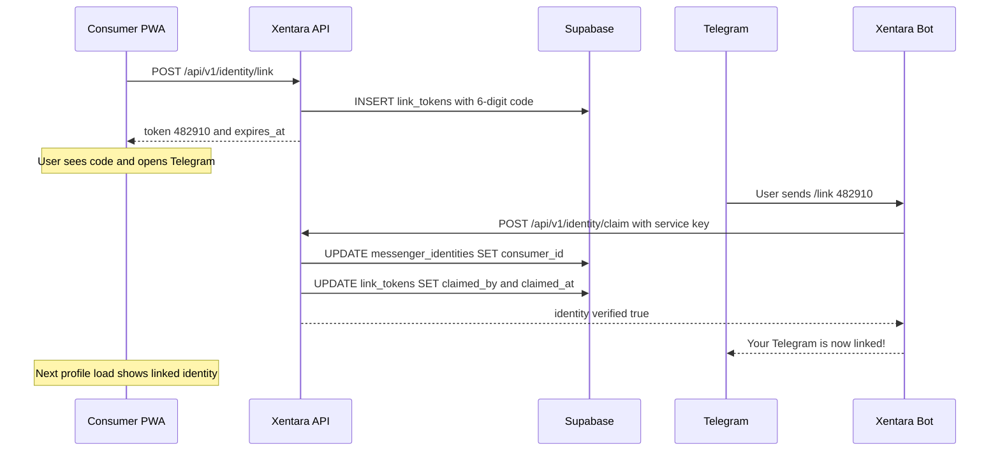

# Phase 8: Selective Push Implementation (WhatsApp/Telegram Webhooks)

This phase introduces the **Distribution & Notification Agent** — the system that selectively pushes published intelligence from Xentara Hubs to Telegram channels/groups and WhatsApp recipients. It completes the "Identity Hydration" loop started in Phase 7 by adding the bot-side code that accepts link codes.

## User Review Required

> [!IMPORTANT]
> **5 open questions at the bottom of this document** require your input before execution begins. They concern bot hosting, WhatsApp tier, distribution model, formatting strategy, and rate limiting.

> [!WARNING]
> This phase introduces **external service integrations** (Telegram Bot API, WhatsApp Cloud API) that require API credentials and webhook verification. Bot tokens and API keys must be stored as server-side environment variables only, never exposed to the client.

---

## Current State (Post-Phase 7)

| Layer                 | Status                                                                                   |
|:--------------------- |:---------------------------------------------------------------------------------------- |
| **Consumer Identity** | ✅ `consumer_profiles`, `hub_subscriptions`, `messenger_identities`, `link_tokens` tables |
| **Identity API**      | ✅ Link token generation, manual claim endpoint, identity management                      |
| **Hub Subscriptions** | ✅ Subscribe/unsubscribe via API, subscriber count (anonymized)                           |
| **PWA Auth**          | ✅ Cross-origin Bearer token auth, profile/subscriptions/link pages                       |
| **Inngest Pipeline**  | ✅ Discovery → Ingestion → Summary → Taste → Taxonomy → Normalization                     |
| **Distribution**      | ❌ No push delivery — publications only visible via PWA feed                              |
| **Messenger Bots**    | ❌ No bots — link codes can only be claimed via manual admin endpoint                     |
| **Formatting**        | ❌ No messenger-specific content formatting                                               |

---

## Proposed Changes

### Component 1: Database Schema

#### [NEW] `supabase/migrations/20260409000000_distribution_channels.sql`

Creates 2 new tables and extends the publication status lifecycle.

##### Table 1: `hub_channels` (Links hubs to messenger delivery targets)

```sql
CREATE TABLE public.hub_channels (
    id             UUID PRIMARY KEY DEFAULT gen_random_uuid(),
    hub_id         UUID NOT NULL REFERENCES public.hubs(id) ON DELETE CASCADE,
    platform       TEXT NOT NULL CHECK (platform IN ('telegram', 'whatsapp')),
    channel_id     TEXT NOT NULL,            -- Telegram chat_id or WhatsApp group/broadcast ID
    channel_name   TEXT,                     -- Human-readable label
    is_active      BOOLEAN DEFAULT true,     -- Toggle distribution on/off
    added_by       UUID REFERENCES public.profiles(id),
    created_at     TIMESTAMPTZ DEFAULT now() NOT NULL,
    UNIQUE(hub_id, platform, channel_id)
);
```

- **Purpose**: Curators configure which Telegram channels/groups or WhatsApp targets receive publications from their hub.
- **RLS**: Only hub owners/editors can manage channels for their hubs.

##### Table 2: `distribution_log` (Audit trail for all push deliveries)

```sql
CREATE TABLE public.distribution_log (
    id              UUID PRIMARY KEY DEFAULT gen_random_uuid(),
    publication_id  UUID NOT NULL REFERENCES public.publications(id) ON DELETE CASCADE,
    hub_channel_id  UUID REFERENCES public.hub_channels(id) ON DELETE SET NULL,
    platform        TEXT NOT NULL CHECK (platform IN ('telegram', 'whatsapp')),
    target_id       TEXT NOT NULL,            -- chat_id, phone number, or channel_id
    status          TEXT DEFAULT 'pending'
                    CHECK (status IN ('pending', 'sent', 'failed', 'rate_limited')),
    message_id      TEXT,                     -- Platform-specific message ID (for later edits/deletes)
    error_message   TEXT,
    sent_at         TIMESTAMPTZ,
    created_at      TIMESTAMPTZ DEFAULT now() NOT NULL
);
```

- **Purpose**: Tracks every distribution attempt for debugging, dedup, and analytics.
- **Key design**: `hub_channel_id` is nullable — direct-to-subscriber pushes (DMs) don't reference a channel.

##### Additional Schema Elements

- Index on `distribution_log(publication_id)` and `distribution_log(hub_channel_id)`
- Index on `hub_channels(hub_id)`
- RLS: `distribution_log` is service-role only (no direct user access). Curators see delivery status via API routes.

---

### Component 2: Telegram Bot

#### Technology Choice: **grammY** (`grammy` npm package)

grammY is the modern, TypeScript-native Telegram Bot framework. It offers:

- Full type safety
- Built-in webhook support (no polling needed in production)
- Middleware architecture (similar to Express/Koa)
- Active maintenance and ecosystem

#### Bot Architecture

The bot runs as a **webhook handler** inside the Next.js API routes, not as a standalone process. This avoids managing a separate Node.js service and keeps everything within the existing deployment.

#### [NEW] `src/lib/telegram/bot.ts`

Core bot instance and command handlers:

```typescript
import { Bot } from 'grammy'

const bot = new Bot(process.env.TELEGRAM_BOT_TOKEN!)

// /start - Welcome message with instructions
bot.command('start', async (ctx) => {
  await ctx.reply(
    '🧠 *Xentara Intelligence Bot*\n\n' +
    'I deliver curated intelligence from Xentara Hubs directly to your Telegram.\n\n' +
    '*Commands:*\n' +
    '/link `<code>` — Link this Telegram account to your Xentara profile\n' +
    '/subscribe `<hub>` — Subscribe to a hub\'s push notifications\n' +
    '/myhubs — List your active hub subscriptions\n' +
    '/help — Show this message again',
    { parse_mode: 'Markdown' }
  )
})

// /link <code> - Complete identity hydration from Phase 7
bot.command('link', async (ctx) => {
  const code = ctx.match?.trim()
  // 1. Validate code format (6 digits)
  // 2. Call identity claim API (service role)
  // 3. Update messenger_identity with the Telegram user's info
  // 4. Reply with success/failure
})

// /subscribe <hub-slug> - Subscribe to a hub
bot.command('subscribe', async (ctx) => {
  const slug = ctx.match?.trim()
  // 1. Resolve hub by slug
  // 2. Ensure messenger_identity exists for this Telegram user
  // 3. If linked to a consumer, create hub_subscription
  // 4. If shadow profile, create subscription via temporary shadow consumer
  // 5. Reply with confirmation
})

// /myhubs - List subscriptions
bot.command('myhubs', async (ctx) => {
  // 1. Find messenger_identity for this user
  // 2. If linked, fetch hub_subscriptions for consumer_id
  // 3. Reply with formatted list
})

export { bot }
```

#### [NEW] `src/lib/telegram/formatter.ts`

Formats publications for Telegram delivery:

```typescript
export function formatPublicationForTelegram(publication: Publication, hub: Hub): string {
  // Telegram supports Markdown V2
  // Structure:
  //   🧠 Hub Name
  //   ━━━━━━━━━━
  //   📰 Title (linked)
  //   By byline
  //
  //   Summary (truncated to 3000 chars for Telegram limits)
  //
  //   🏷️ tag1 · tag2 · tag3
  //   📊 Sentiment: ■■■■□ (60%)
  //
  //   💬 Curator's Take: commentary
  //
  //   🔗 Read Full → source_url
}
```

---

### Component 3: WhatsApp Integration

#### Technology: **WhatsApp Business Cloud API** (Meta Graph API v21.0+)

The WhatsApp integration uses the official Cloud API hosted by Meta. This requires:

- A Meta Business Account
- A phone number registered with WhatsApp Business
- Webhook verification via the Graph API

#### [NEW] `src/lib/whatsapp/client.ts`

WhatsApp API client wrapper:

```typescript
const WHATSAPP_API_BASE = 'https://graph.facebook.com/v21.0'
const PHONE_NUMBER_ID = process.env.WHATSAPP_PHONE_NUMBER_ID
const ACCESS_TOKEN = process.env.WHATSAPP_ACCESS_TOKEN

export async function sendWhatsAppMessage(to: string, text: string): Promise<string | null> {
  const res = await fetch(
    `${WHATSAPP_API_BASE}/${PHONE_NUMBER_ID}/messages`,
    {
      method: 'POST',
      headers: {
        Authorization: `Bearer ${ACCESS_TOKEN}`,
        'Content-Type': 'application/json',
      },
      body: JSON.stringify({
        messaging_product: 'whatsapp',
        to,
        type: 'text',
        text: { preview_url: true, body: text },
      }),
    }
  )
  const data = await res.json()
  return data.messages?.[0]?.id ?? null
}
```

#### [NEW] `src/lib/whatsapp/formatter.ts`

Formats publications for WhatsApp delivery (plain text, no Markdown):

```typescript
export function formatPublicationForWhatsApp(publication: Publication, hub: Hub): string {
  // WhatsApp supports basic formatting:
  //   *bold*, _italic_, ~strikethrough~, ```monospace```
  // Structure:
  //   🧠 *Hub Name*
  //   ──────────
  //   📰 *Title*
  //   _By byline_
  //
  //   Summary (truncated to 4096 chars for WhatsApp limits)
  //
  //   🏷️ tag1 · tag2
  //
  //   💬 _Curator's Take:_ commentary
  //
  //   🔗 source_url
}
```

---

### Component 4: Webhook API Routes

#### [NEW] `src/app/api/v1/webhooks/telegram/route.ts`

Telegram Bot API webhook handler:

```typescript
export async function POST(request: NextRequest) {
  // 1. Verify the request comes from Telegram (secret_token header)
  // 2. Parse the Update object
  // 3. Pass to grammY's bot.handleUpdate()
  // 4. Return 200 OK
}
```

#### [NEW] `src/app/api/v1/webhooks/whatsapp/route.ts`

WhatsApp Cloud API webhook handler:

```typescript
// GET: Webhook verification (hub.challenge)
export async function GET(request: NextRequest) {
  const mode = searchParams.get('hub.mode')
  const token = searchParams.get('hub.verify_token')
  const challenge = searchParams.get('hub.challenge')
  // Verify and return challenge
}

// POST: Incoming messages (link codes, reactions)
export async function POST(request: NextRequest) {
  // 1. Parse webhook payload
  // 2. Extract incoming messages
  // 3. Handle link code submissions
  // 4. Handle subscription commands
  // 5. Return 200 OK (always, per WhatsApp requirements)
}
```

#### [NEW] `src/app/api/v1/hubs/[slug]/channels/route.ts`

Hub channel management (curator-facing):

```typescript
// GET: List configured distribution channels for a hub
export async function GET(request: Request, { params }: Params) {
  // Requires hub owner/editor role
  // Returns hub_channels for the hub
}

// POST: Add a new distribution channel
export async function POST(request: NextRequest, { params }: Params) {
  // Body: { platform, channel_id, channel_name }
  // Requires hub owner/editor role
  // Validates bot has access to the channel (Telegram: getChat)
}

// DELETE: Remove a distribution channel
export async function DELETE(request: NextRequest, { params }: Params) {
  // Query: ?channel_id=<uuid>
  // Requires hub owner/editor role
}
```

#### [NEW] `src/app/api/v1/hubs/[slug]/distribution/route.ts`

Distribution history (curator-facing):

```typescript
// GET: View distribution log for a hub's publications
export async function GET(request: Request, { params }: Params) {
  // Requires hub owner/editor role
  // Returns recent distribution_log entries with status
}
```

---

### Component 5: Distribution Agent (Inngest)

The centerpiece of Phase 8 — the event-driven distribution pipeline.

#### [NEW] `src/inngest/distribution.ts`

```typescript
/**
 * DISTRIBUTION AGENT
 * Triggered when a curator publishes a publication.
 * Determines targets, formats content, and pushes to messengers.
 */
export const distributePublication = inngest.createFunction(
  {
    id: 'xentara-distribution-agent',
    triggers: [{ event: 'xentara/publication.published' }],
    concurrency: { limit: 5 },
    retries: 2,
  },
  async ({ event, step }) => {
    const { publicationId, hubId } = event.data

    // Step 1: Fetch publication + hub details
    const context = await step.run('fetch-distribution-context', async () => {
      // Get publication, hub, hub_channels, and subscriber list
    })

    // Step 2: Format content for each platform
    const formatted = await step.run('format-for-platforms', async () => {
      return {
        telegram: formatPublicationForTelegram(context.publication, context.hub),
        whatsapp: formatPublicationForWhatsApp(context.publication, context.hub),
      }
    })

    // Step 3: Broadcast to hub channels (public channels/groups)
    await step.run('broadcast-to-channels', async () => {
      for (const channel of context.channels) {
        if (channel.platform === 'telegram') {
          await sendTelegramMessage(channel.channel_id, formatted.telegram)
        } else if (channel.platform === 'whatsapp') {
          await sendWhatsAppMessage(channel.channel_id, formatted.whatsapp)
        }
        // Log to distribution_log
      }
    })

    // Step 4: Push to individual subscribers (DMs)
    // Only subscribers with notification_preference !== 'none'
    // For 'highlights' preference, check if publication has high sentiment or curator_commentary
    await step.run('push-to-subscribers', async () => {
      for (const subscriber of context.eligibleSubscribers) {
        // Resolve messenger_identities for this consumer
        // Send via appropriate platform
        // Log to distribution_log
      }
    })

    return {
      status: 'distributed',
      channels: context.channels.length,
      subscribers: context.eligibleSubscribers.length,
    }
  }
)
```

#### [MODIFY] `src/app/dashboard/actions.ts` → `publishPublication()`

Add Inngest event emission after successful publication:

```diff
 export async function publishPublication(id: string, formData: FormData) {
   // ... existing update logic ...

   if (error) throw new Error(error.message)

+  // Trigger distribution agent
+  try {
+    const { data: pub } = await supabase
+      .from('publications')
+      .select('hub_id')
+      .eq('id', id)
+      .single()
+
+    if (pub) {
+      await inngest.send({
+        name: 'xentara/publication.published',
+        data: { publicationId: id, hubId: (pub as any).hub_id }
+      })
+    }
+  } catch (inngestError) {
+    console.warn('Distribution event failed:', inngestError)
+  }

   revalidatePath('/dashboard')
   revalidatePath('/dashboard/history')
   return { success: true }
 }
```

#### [MODIFY] `src/inngest/functions.ts`

Register the new distribution function in the Inngest serve handler.

#### [MODIFY] `src/app/api/inngest/route.ts`

Add the new function to the serve array.

---

### Component 6: Dashboard Updates

#### [MODIFY] Hub Settings / Distribution Panel

Add a new "Distribution" tab or section to the hub settings page:

1. **Connected Channels**
   
   - List of configured Telegram channels/groups and WhatsApp targets
   - Add/remove controls
   - Active/inactive toggle per channel
   - "Test Push" button (sends a test message to verify connectivity)

2. **Distribution Preferences**
   
   - Toggle: "Auto-push on publish" (default: on)
   - Notification filter: Push all publications or only "highlights" (high sentiment / with curator commentary)

3. **Distribution History**
   
   - Recent push log showing status (sent/failed/rate_limited)
   - Per-publication view: which channels/subscribers received it
   - Error details for failed deliveries

---

### Component 7: Environment Variables

#### New Required Variables

```env
# Telegram Bot
TELEGRAM_BOT_TOKEN=<bot_token_from_@BotFather>
TELEGRAM_WEBHOOK_SECRET=<random_secret_for_webhook_verification>

# WhatsApp Business Cloud API (deferred if Q2 = Option C)
WHATSAPP_PHONE_NUMBER_ID=<meta_phone_number_id>
WHATSAPP_ACCESS_TOKEN=<meta_access_token>
WHATSAPP_VERIFY_TOKEN=<custom_verify_token_for_webhook_setup>
WHATSAPP_APP_SECRET=<meta_app_secret_for_payload_verification>
```

#### Production Webhook URLs

```
Telegram:  https://xentara.vercel.app/api/v1/webhooks/telegram
WhatsApp:  https://xentara.vercel.app/api/v1/webhooks/whatsapp
```

---

## Architecture: The Distribution Flow



---

## The Identity Hydration Completion

Phase 8 closes the loop opened by Phase 7's manual claim endpoint. With the Telegram bot live:



---

## Selective Push Logic

The "selective" in "Selective Push" refers to the notification filtering system:

| Subscriber Setting                      | Publication Type                                     | Action                              |
|:--------------------------------------- |:---------------------------------------------------- |:----------------------------------- |
| `notification_preference: 'all'`        | Any published item                                   | ✅ Push immediately                  |
| `notification_preference: 'highlights'` | Has `curator_commentary` OR `sentiment_score >= 0.7` | ✅ Push                              |
| `notification_preference: 'highlights'` | Standard publication without commentary              | ❌ Skip (available in PWA feed only) |
| `notification_preference: 'none'`       | Any                                                  | ❌ Never push (PWA feed only)        |

Channel broadcasts (to Telegram groups/channels) **always receive all publications** regardless of subscriber settings. The selective filtering only applies to individual DMs.

---

## Decisions

> [!NOTE]
> ### 1. Bot Hosting: Webhook Mode
> **Decision**: Webhook mode. It integrates naturally with Next.js API routes, requires no additional infrastructure, and is the Telegram-recommended approach for production bots.

> [!NOTE]
> ### 2. WhatsApp Tier: Defer for now
> **Decision**: Option C — build Telegram bot first to validate the distribution architecture, then layer WhatsApp on top. The API abstraction layer will make WhatsApp a drop-in addition. This avoids Meta Business verification delays blocking Phase 8 progress.

> [!NOTE]
> ### 3. Distribution Model: Channel-First, DMs later
> **Decision**: Option A first (channel broadcasts), with eventual expansion to Option C (both). Channel broadcasts are the primary use case for "Intelligence Streams". Subscriber DMs will be added once the channel infrastructure is proven.

> [!NOTE]
> ### 4. Formatting: Template-Based
> **Decision**: Option B for Phase 8, graduating to Option C later. Templates are fast and free. AI assistance will be extended during the *initial ingest* in future phases to identify suitable images to be included in media such as Telegram that allows for them.

> [!NOTE]
> ### 5. Rate Limiting Strategy: Priority Queue
> **Decision**: Option C. Inngest provides concurrency controls. Channel broadcasts have higher priority since they affect all channel members. Subscriber DMs will be dispatched in a separate Inngest step with lower concurrency limits.

---

## Verification Plan

### Automated Tests

1. **Migration**: Apply migration to the Supabase project and verify `hub_channels` and `distribution_log` tables, constraints, and indexes
2. **RLS Policies**: Verify hub owners/editors can manage channels but not access distribution_log directly
3. **Type Check**: `pnpm build` across the monorepo — dashboard and consumer-pwa must compile
4. **Webhook Signature**: Test that invalid webhook payloads are rejected

### Integration Tests

5. **Telegram Bot**:
   - Send `/start` → verify welcome message
   - Send `/link 123456` → verify identity claim API is called
   - Send `/link invalid` → verify error response
   - Send `/subscribe hub-slug` → verify subscription created
   - Send `/myhubs` → verify subscription list returned
6. **Distribution Pipeline**:
   - Publish a publication → verify `xentara/publication.published` event emitted
   - Verify Inngest function receives event and fetches correct context
   - Verify formatted message is sent to configured Telegram channel
   - Verify `distribution_log` entry created with correct status

### Manual Verification

7. **E2E Flow**:
   - Configure a test Telegram channel as distribution target for a hub
   - Publish a publication from the dashboard
   - Verify the publication appears in the Telegram channel within 30 seconds
   - Verify the distribution history shows "sent" status in the dashboard
8. **Identity Hydration**:
   - Generate link code on PWA → send to bot via `/link` → verify identity linked on profile page
9. **Selective Push**:
   - Create two test subscribers: one with `all`, one with `highlights`
   - Publish a standard publication → verify only `all` subscriber receives DM
   - Publish a publication with curator commentary → verify both receive DM

### Security

10. **Webhook verification**: Confirm Telegram secret_token validation rejects spoofed requests
11. **Service key isolation**: Confirm bot's Supabase calls use service role and never expose credentials
12. **Input sanitization**: Verify bot commands handle malicious input gracefully

---

## Execution Order (Suggested)

| Step | Component                                             | Estimated Effort |
|:---- |:----------------------------------------------------- |:---------------- |
| 1    | Database migration (hub_channels, distribution_log)   | Small            |
| 2    | Telegram bot core + webhook handler                   | Medium           |
| 3    | Publication formatter (Telegram)                      | Small            |
| 4    | Distribution Agent (Inngest function)                 | Medium           |
| 5    | Modify `publishPublication()` to emit event           | Small            |
| 6    | Hub channel management API routes                     | Small            |
| 7    | Dashboard: Channel configuration UI                   | Medium           |
| 8    | Dashboard: Distribution history panel                 | Small            |
| 9    | Bot identity linking (`/link` command)                | Small            |
| 10   | Subscriber DM push (optional, post-channel broadcast) | Medium           |
| 11   | WhatsApp integration (deferred if Q2 = Option C)      | Large            |

**Total estimated scope**: ~2–3 development sessions for core (steps 1–8), +1 for subscriber DMs, +1 for WhatsApp.
